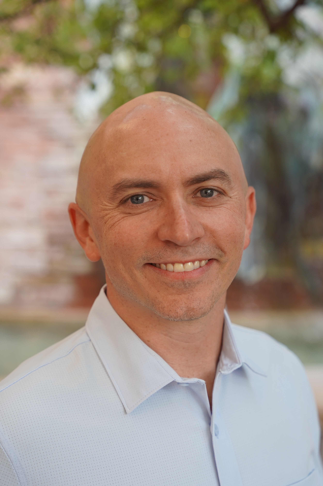

I have been lucky to have so many amazing opportunities throughout my career, working with some of the smartest engineers and technologists in the world and filling various roles from software developer to technology evangelist to technology executive.

I first started programming in middle school by writing Pascal-based scripts for VT220 telnet clients that automatically played (and leveled) characters in [MUDs](http://en.wikipedia.org/wiki/MUD). Since then, I've worked on increasingly more complex solutions (if not as fun) including large-scale commerce implementations, low-latency distributed messaging systems, and building developer platforms.

These days I'm the Chief Ecosystem and Growth Officer at [DigitalOcean](https://www.digitalocean.com/), where I oversee Developer Relations, Marketing, Growth, and Partnerships. It's a role that brings together so many of the things I've loved throughout my career—building communities, empowering developers, and helping shape how companies grow their ecosystems. Before DigitalOcean, I led product at [Foursquare](https://foursquare.com/) as SVP and Global Head of Product, helping shape the strategy for their geospatial products. And before that, I was the Chief Product Officer at [Rapid](https://rapidapi.com/), working on the world's largest API marketplace. The thread connecting all these roles—and earlier stints at Twilio, Salesforce, and Microsoft—has always been the same: finding ways to make developers' lives better and helping companies build meaningful platforms.

But life's most meaningful challenges often find us outside the office. After discovering ultrarunning, I found a passion in exploring the limits of human endurance. What started as a personal journey has grown into something more meaningful, the opportunity to coach and guide other runners in their own ultradistance adventures. As a UESCA-certified ultrarunning coach, I've combined my love for systematic thinking with the raw challenge of long-distance trail running.

I believe in sharing these adventures and insights along the way. If you'd like to connect or follow along on these journey, you can find me on [Twitter](https://x.com/wadewegner).

