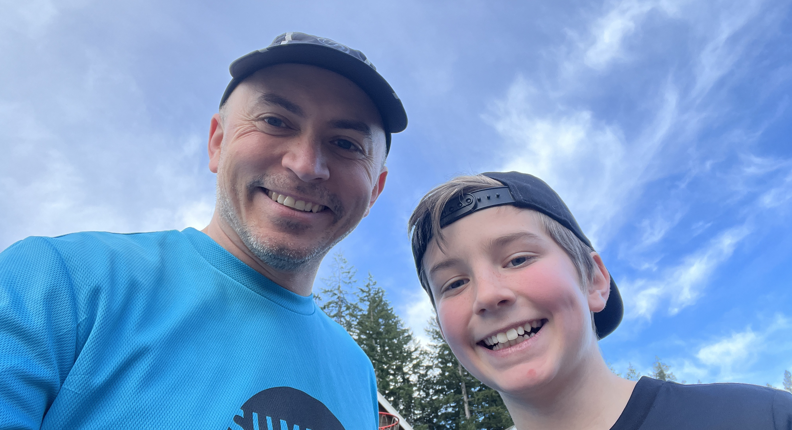
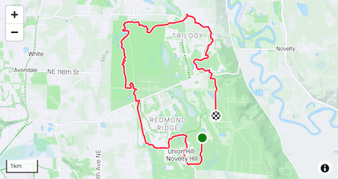

_<figcaption>My son and me before running the trails in the neighborhood.</figcaption>_

#### Summary

Week 3 was a recovery week. As I mentioned in [last week's post](https://www.wadewegner.com/2023/01/training-week-in-review-january-8-2023/), I just finished the Lactate Threshold block. Next week, I'll start the Steady State block.

The Steady State block is my favorite training block. While there is variety, it typically involved running 90 minutes with two 30 minute blocks at Steady State, which is characterized by a Rate of Perceived Exersion (RPE) of 7. During a Steady State effort, you should be able to say a few sentences between breaths. It's just below your Tempo run effort, but not as easy as an Endurance effort.

But that's next week. This week was about rest and recovery. The timing was good as I was in San Francisco for work. I have to workout pretty early to avoid disrupting busy days, and so I opt for treadmills given I don't like running in the city at night.

**Run Duration**: 6:54 | 6:15 (h:m) 
**Total TSS**: 453 | 433 
**Total Distance**: 34.2 mi

I'm pretty happy with the week. I got much needed recovery during the week, and a couple long runs on the weekend.

##### Monday

**Rest**

I found Monday's rest day to be much needed. Between traveling to SF and the long runs on the weekend, getting some rest was fantastic.

##### Tuesday

**Recovery Run 45min**

I was up reasonably early and ran around 5:42am. Nothing in particular to report. I felt decent and it was easy.

**RPE**: 3 | 4-5 
**Felt**: Normal 
**Time**: 0:45:06 | 0:45:00 (h:m:s) 
**Distance**: 3.82 (mi) 
**Average pace**: 11:47 (min/mi) 
**Elevation**: 0 (ft) 
**TSS**: 47 | 45 
**IF**: 0.75 | 0.77 

##### Wednesday

**Recovery Run 45min**

Nothing notable. I woke a bit later in the morning and ran around 6:30am.

**RPE**: 3 | 4-5 
**Felt**: Normal 
**Time**: 0:45:03 | 0:45:00 (h:m:s) 
**Distance**: 3.93 (mi) 
**Average pace**: 11:27 (min/mi) 
**Elevation**: 0 (ft) 
**TSS**: 50 | 45 
**IF**: 0.77 | 0.77 

##### Thursday

**Recovery Run 45min**

I cut this run short after feeling a bit rough. I think a few things contributed to it:

1. I slept poorly most of the week. It was a terrible hotel.
2. I woke around 4am.
3. I forgot to get a bite to eat before running. I almost always need some kind of food.

It's all good, though. I still broke a sweat.

**RPE**: 2 | 4-5 
**Felt**: Somewhat bad 
**Time**: 0:30:24 | 0:45:00 (h:m:s) 
**Distance**: 2.56 (mi) 
**Average pace**: 11:52 (min/mi) 
**Elevation**: 0 (ft) 
**TSS**: 47 | 31 
**IF**: 0.75 | 0.75 

##### Friday

**Rest**

My last rest day on Friday for awhile.

##### Saturday

**Endurance Run 2 Hours w/ 3x 10min Tempo Intervals**

What a lovely day to run! I felt very lucky that my son wanted to start off the run with me.

I'll be honest, I didn't really work the tempo intervals. I treated this more like a 2 hours endurance run. And I'm okay with it. I didn't quite get the intensity in that the intervals would have brought, but it's okay.

Despite the endurance pace, I was kind of tired by the end of the run.

**RPE**: 7 | 7-9 
**Felt**: Normal 
**Time**: 2:10:55 | 2:00:00 (h:m:s) 
**Distance**: 11.6 (mi) 
**Average pace**: 11:18 (min/mi) 
**Elevation**: 778 (ft) 
**TSS**: 158 | 155 
**IF**: 0.89 | 0.79 

#### Sunday

**Endurance Run 2 Hours**

Sunday was an interesting day. The night before, I had stayed up late playing games and eating great food with family and friends. (No alcohol.) Didn't get to sleep until around 11:30pm, which is very late for me.

I woke with a headache, and could tell by my sleep data that my body struggled all night. The headache persisted all morning, and so I throw out my plans to run Cougar mountain in the morning.

Fortunately, I rallied a bit after lunch (at least my headache went away) and decided to give a run through the Watershed Park a try. And I'm so glad I did even though I was drenched by the end of it!

Sunday's run started off with me feeling weak and not sure if I'd be able to last two hours. But the longer I ran, the better I felt. By the end of it, I felt I could run another mile! A tremendous transformation from how I had felt earlier.

By the time I got home it was pretty dark and mist had settled in the trees. It was a bit spooky. I even decided to turn on some music (Bad Wolves radio on Spotify) to ward off any curious animals.

All-in-all, a lovely run.

**RPE**: 4 | 5-6 
**Felt**: Somewhat Good 
**Time**: 2:21:12 | 2:00:00 (h:m:s) 
**Distance**: 12.3 (mi) 
**Average pace**: 11:31 (min/mi) 
**Elevation**: 676 (ft) 
**TSS**: 140 | 160 
**IF**: 0.84 | 0.77 

I wrap up week 3 feeling good and excited to start my Steady State workouts next week!
