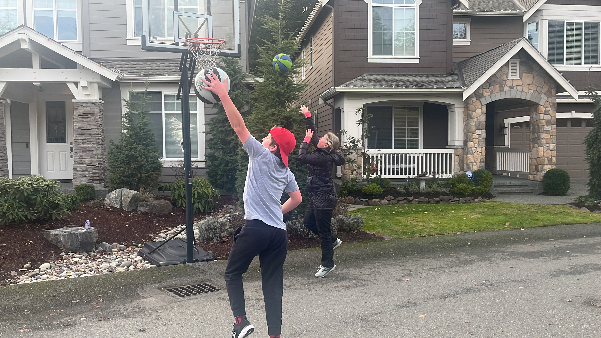
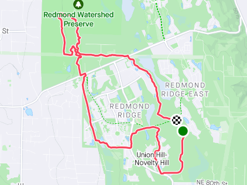
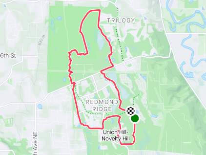
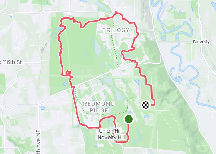

_<figcaption>Playing "bump" with my son and wife during the week.</figcaption>_

I think this past week marked a turning point for my training. The last few months have brought challenges that were new for me, and consequently I struggled with recovery and rest. I've been able to debug and resolve most of those issues, and as a result feel as if I'm headed in the right direction.

As this is my first "Week-In-Review" post, I'll share a few things to set some context:

- I've been training several months for the Chuckanut 50k on 18, 2023. This is one of my favorite races. Shortly after this race I'll transition towards a 50 mile run in August.
- I'm following the [CTS 50K Ultramarathon Training Plan - Advanced (20 weeks)](https://trainright.com/membership/training-plans/running/). I've used the Intermediate plan twice before. It's my first time following advanced.
- The training is broken up into different training blocks (each are four weeks long) and get more specific as I get closer to the event. The blocks are:

  - VO2 Max - high intensity, low volume
  - Lactate Threshold - develop and improve lactate threshold
  - Steady State - build a stronger aerobic engine and increase volume
  - Endurance/Steady State - train for specific event demands; highest volume, lowest intensity

- Between each training block is a recovery week.
- There are 10 more weeks until race day!

#### Summary

This week, I wrapped up the Steady State block. I won't lie, it was tough. State state workouts generally involve three intervals run for 10 minutes at an RPE of 8-9. This means that I'm running HARD for 10 minutes. Making this harder, we had a lot of snow in December, and the majority of my runs ended up on the treadmill (which I love but also hate). I do much better with hard runs when I'm outside on a trail.

**Run Duration**: 7:04 | 7:55 (h:m) 
**Total TSS**: 561 | 580 
**Total Distance**: 41.4 mi

I was a little short of goals this week. But it's okay.

##### Monday

**Rest**

I enjoyed the rest. I ran a 25k at Deception Pass State Park the previous Saturday and a recovery run on Sunday at Lord Hill. A day off the feet was appreciated.

##### Tuesday

**Tempo Run 3x10min**

I ran a 7.79mi loop around my house that took me into the Redmond Watershed. This was the first time I'd been on the trails around my house in a long time, and it felt glorious. It was also fun seeing some minor changes here and there (e.g. new gravel path).

**RPE**: 8 | 8-9 
**Felt**: Normal 
**Time**: 1:22:32 | 1:20:00 (h:m:s) 
**Distance**: 7.79 (mi) 
**Average pace**: 10:36 (min/mi) 
**Elevation**: 482 (ft) 
**TSS**: 110 | 110 
**IF**: 0.85 | 0.91 

##### Wednesday

**Recovery Run 45 min**

I just wasn't feeling it on Wednesday. After a lovely time running on trails the day before, the treadmill felt like punishment. I cut this a bit short, but did return later in the evening and did a ~32 minute hike on the treadmill.

**RPE**: 3 
**Felt**: Somewhat Weak 
**Time**: 0:30:08 | 0:45:00 (h:m:s) 
**Distance**: 2.17 (mi) 
**Average pace**: 13:55 (min/mi) 
**Elevation**: 0 (ft) 
**TSS**: 22 | 24 
**IF**: 0.64 | 0.77 

##### Thursday

**Tempo Run 3x10min**

I don't actually remember why, but I ran on the treadmill again. Must have been weather related, but it escapes me. I reported feeling normal, but looking at the data you can tell I didn't really push it as hard as I should have.

It's okay.

**RPE**: 7 | 8-9 
**Felt**: Normal 
**Time**: 1:06:22 | 1:20:00 (h:m:s) 
**Distance**: 6.37 (mi) 
**Average pace**: 10:25 (min/mi) 
**Elevation**: 0 (ft) 
**TSS**: 89 | 110 
**IF**: 0.85 | 0.91 

##### Friday

**Easy Hike**

My training plan has Friday's as a rest day, but I felt pretty good and decided to do a hike on the treadmill. It's pretty nice to walk and watch Netflix.

**RPE**: 3 
**Felt**: Normal 
**Time**: 0:41:54 (h:m:s) 
**Distance**: 1.94 (mi) 
**Average pace**: 21:36 (min/mi) 
**Elevation**: 0 (ft) 
**TSS**: 29 
**IF**: 0.62 

##### Saturday

**Endurance Run 2 Hours**

For me, one of the best things is to run with my son. He joined me for this workout. He's still building up again in preparation for a race we're doing in Febuary, so we went a bit slower than normal. (He's typically faster than me.) Consequently, the intensity was a bit less than I had hoped, but it was still a lovely run.

It was chilly and rainy outside. I got a new jacket recently that's water proof; problem is, I sweat so much that I get as wet on the inside as I am on the outside.

**RPE**:  
**Felt**:  
**Time**: 1:47:25 | 2:00:00 (h:m:s) 
**Distance**: 9.19 (mi) 
**Average pace**: 11:41 (min/mi) 
**Elevation**: 381 (ft) 
**TSS**: 118 | 140 
**IF**: 0.76 | 0.84 

#### Sunday

**Endurance Run 2.5 Hours**

It was another cold and wet day in the Pacific Northwest! But as they say, there's no such thing as bad weather, just bad gear! And I love it!

Back-to-back long runs are key to my training strategy. Today felt great! In fact, I felt better today than I did the day before. I had a solid night of sleep and a lot of rest after the run yesterday, so I'm sure that helped!

**RPE**:  
**Felt**:  
**Time**: 2:17:57 | 2:30:00 (h:m:s) 
**Distance**: 12.3 (mi) 
**Average pace**: 11:12 (min/mi) 
**Elevation**: 807 (ft) 
**TSS**: 165 | 175 
**IF**: 0.80| 0.84 

All-in-all, a great week of training!

Next week is all about recovery, so it'll be nice and easy. I'm also planning to figure out how to start incorporating some strength training into my regular routine.
