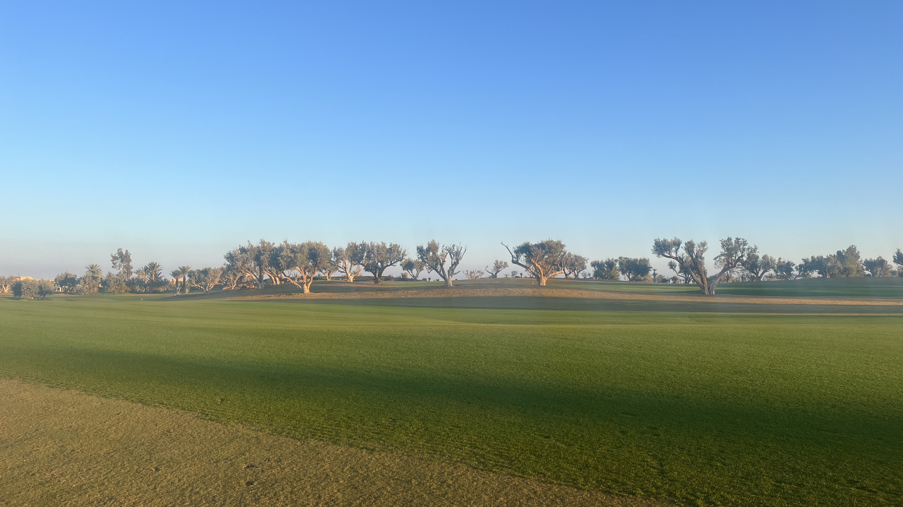
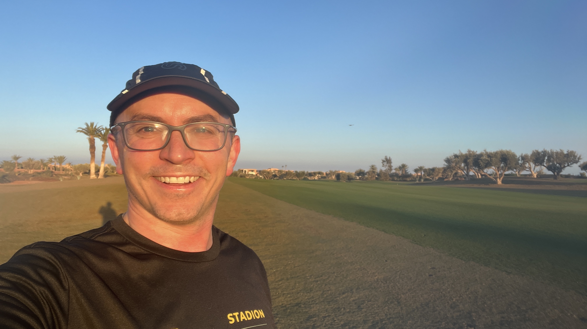
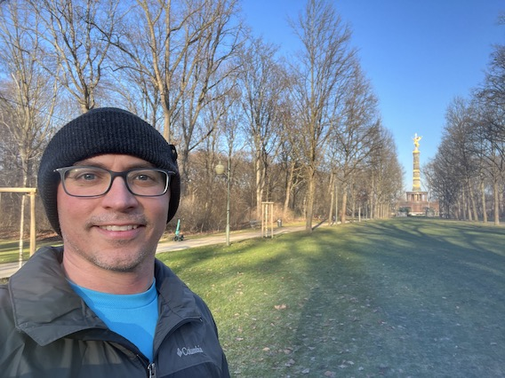
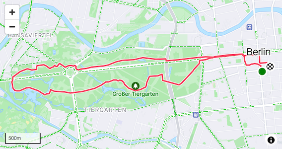
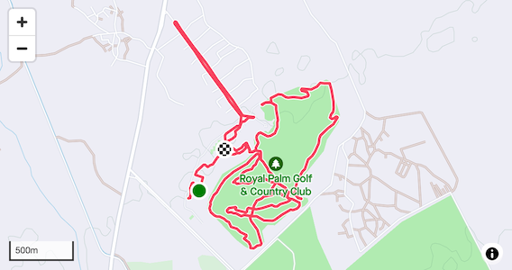

<table>
<tr>
    <td colspan="2">
        
    </td>
</tr>
<tr>
    <td>
        
    </td>
    <td>
        
    </td>
</tr>
</table>

#### Summary

Week 4 started out with a few bumps. I developed a pretty bad chest cold that got progressively worse through the week. Additionally, I traveled to Berlin and, likely because of the chest cold, did not sleep well on the trip and as a result started off my visit with some bad jet lag. I then ended the week traveling to Marrakech and, fortunately, was on the mend.

Early in the week I asked folks on Mastodon (and Twitter) what they do when this happens. Most said to rest. I didn't want to fully rest, however, as I was keen to start my Steady State workout. So I adapted the training as best I could and modified my workouts depending how I felt that day.

Speaking of Steady State workouts, these are my favorites. In the past, I feel as if I've seen the most growth in my capacity as a runner during these Steady State blocks.

A State State interval has a Rate of Perceived Exertion (RPE) of 7, so you should be breathing deeply but could still say a few sentences. I feel like it's a great way to build stamina and start to build a strong base of miles.

Steady State intervals are usually balanced by an Endurance Run pace, which is an RPE of 5-6, defined as rhythmic breathing, and not labored at any point. Something you could do for hours.

The block is basically:

- **Monday**: Rest
- **Tuesday**: 2x30 intervals
- **Wednesday**: Endurance run
- **Thursday**: 2x20 intervals
- **Friday**: Recovery run
- **Saturday**: Long endurance run with 2x20 Steady State
- **Sunday**: Long endurance run.

I had to play around with this week quite a bit due to the aforementioned issues. And as a result, as you can see below, I didn't quite hit my numbers.

**Run Duration**: 5:30 | 7:54 (h:m) 
**Total TSS**: 401 | 590 
**Total Distance**: 27.3 mi

That said, I'm pleased I was able to get some training in. What doesn't kill us makes us stronger, right?

##### Monday

**Rest**

##### Tuesday

**Steady State Run 2x30 min**

Due to my cold, I did not run on Tuesday. ☹️

##### Wednesday

**Steady State Run 2x30 min**

I still wasn't feeling good on Wednesday, but I pushed through it. I noted that my heart rate was higher than normal at my easy warm-up pace.

I ran on the treadmill to make it a bit easier.

**RPE**: 7 | 7 
**Felt**: Somewhat Weak 
**Time**: 1:30:02 | 1:30:00 (h:m:s) 
**Distance**: 8.83 (mi) 
**Average pace**: 10:12 (min/mi) 
**Elevation**: 0 (ft) 
**TSS**: 127 | 109 
**IF**: 0.87 | 0.85 

##### Thursday

**Endurance Run 1 Hour**

Immediately after arriving in Berlin, I went out for a run. I was exhausted, but the run helped. I didn't feel particularly strong and was tired towards the end, but it was worth it.

I love Berlin, and I love running in Berlin. Tiergarten is one of my favorites, while hitting Brandenburg Gate and other sites. I admit I was caught off guard by the cold. I had looked at the previous week, and it was in the low 40s. But when I ran, it was in the low 30s. I didn't have the right gear and that made it a bit tougher.

**RPE**: 4 | 5-6 
**Felt**: Somewhat Weak 
**Time**: 0:56:05 | 1:00:00 (h:m:s) 
**Distance**: 5.39 (mi) 
**Average pace**: 10:24 (min/mi) 
**Elevation**: 30 (ft) 
**TSS**: 75 | 70 
**IF**: 0.85 | 0.84 

##### Friday

**Endurance Run 1 Hour**

I was supposed to run a half-marathon simulation, but it wasn't in the cards. I had planned for it and was looking forward to a long run around Berlin, but my chest (and now head) cold simply was too bad.

Given I wasn't feeling well and how cold it was outside, I ran on the treadmill.

After I ran, I did a second activity and hiked for 37:41 (m:s) at a 15% incline.

**RPE**: 4 | n/a 
**Felt**: Normal 
**Time**: 1:00:23 | n/a (h:m:s) 
**Distance**: 5.61 | 13.1 (mi) 
**Average pace**: 10:46 (min/mi) 
**Elevation**: 0 (ft) 
**TSS**: 197 | 76 
**IF**: 0.82 | 0.85 

##### Saturday

**Rest Day**

It was desperately needed. I was not feeling well. I also spent most of the day traveling to Morocco for a company offsite.

#### Sunday

**Endurance Run 1.5 Hours**

At last, an inspiring run and a turning point!

Sunday was my first full day in Marrakech, Morocco, for a Rapid company offsite. I arrived Saturday in the evening. It was dark, but I could tell I was somewhere different and somewhere special.

Fortunately I had started feeling a little better by Sunday. Still not healthy, but well enough that I was looking forward to a nice, refreshing run.

I woke before down (which is surprisingly around 8:15am) and, despite having my headlamp, didn't want to immediately go for a run because I wasn't familiar with the hotel grounds nor the surrounding area. Instead I waited until the sun started to rise, and then I took off.

It was spectacular. Obviously you'd expect a Fairmont hotel to be beautiful, but there's something special about this Fairmont in Marrakech. I started off by exploring the golf courses. I quickly found that the paths only went so far, and so found myself enjoying my run on the soft grass. I pretty much made it everywhere and was going to weave through a bit more when the first golfers hit the course. It was time to transition!

I decided to explore outside the hotel and found a really nice loop that was perfect at 1.2 miles for a single loop.

It was a great way to end the week. As you know, it started off a bit rough, but by the end it was looking up.

**RPE**: 5 | 5-6 
**Felt**: Normal 
**Time**: 1:14:29 | 1:30:00 (h:m:s) 
**Distance**: 7.43 (mi) 
**Average pace**: 10:01 (min/mi) 
**Elevation**: 197 (ft) 
**TSS**: 109 | 105 
**IF**: 0.89 | 0.84 

That's a wrap! Week 4 is complete!
