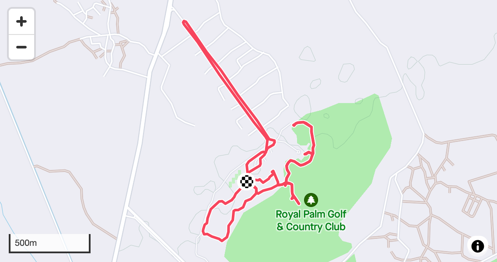
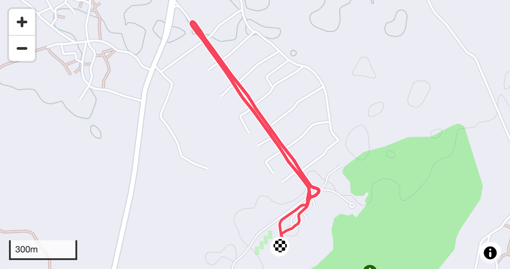
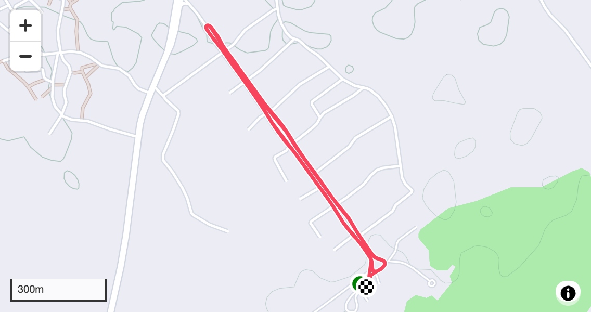
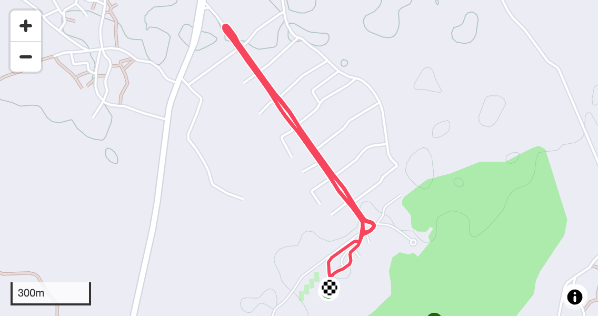
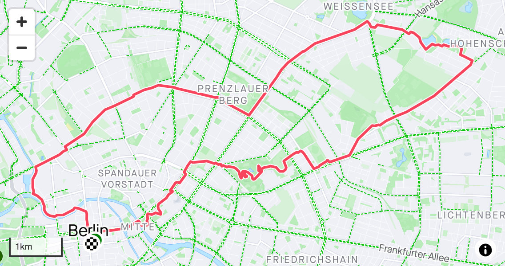

<table>
<tr>
    <td colspan="2">
        
    </td>
</tr>
<tr>
    <td>
        
    </td>
    <td>
        
    </td>
</tr>
</table>

_<figcaption>A picture from the start of my run in Berlin. A selfie while on my 15-mile run in Berlin. A picture of a cactus I saw every morning I ran in Morocco that reminded me of a parent holding their child.</figcaption>_

#### Summary

An amazing week! Not only did I travel to Africa for the first time, but I crushed my training goals for the week. All of this despite lots of travel (three different continents) and energy spent focused on our company's annual kickoff throughout the week.

It's hard to describe how much my training success means to me this week. After having dealt with a bad cold the week before, I really felt good this week.

**Run Duration**: 8:26 | 8:45 (h:m) 
**Total TSS**: 724 | 607 
**Total Distance**: 49.8 mi (almost 50!)

##### Monday

**Recovery Run 45 min**

Interesting story about why I woke up so early for this run.

Our hotel was testing it's backup power system, and so it shutdown the power around 1am. Evidently it didn't work, and power didn't return until 3:45am. When it returned, every single TV in the hotel turned back on and started blasting!

I jumped out of bed, confused. It took me a few minutes to figure out what was happening, find the remote, and turn off the TV. Frazled, I laid back down. Within 30 seconds, the TV turned on again!

This time I unplugged it from the wall.

Sadly, I was unable to get back to sleep. So what to do? Run!

Now that I knew the grounds of the hotel better, I decided to run laps around the front of the hotel. Each lap is 1.2 miles.

Glad I brought my headlamp with me!

**RPE**: 3 | 4-5 
**Felt**: Normal 
**Time**: 0:43:56 | 0:45:00 (h:m:s) 
**Distance**: 4.14 (mi) 
**Average pace**: 10:36 (min/mi) 
**Elevation**: 85 (ft) 
**TSS**: 57 | 45 
**IF**: 0.84 | 0.77 

##### Tuesday

**Steady State Run 2x30 min**

I felt alive on this run! I was able to push the Steady State intervals hard, and I thoroughly enjoyed myself.

Around 7am, the call to pray sounded. I looked up from my run and could see faint signs of sunrise, and suddenly felt a profound sense of peace and gratitude. Runner's high? Maybe. But I think it was more.

**RPE**: 7 | 7 
**Felt**: Somewhat Strong 
**Time**: 1:25:42 | 1:30:00 (h:m:s) 
**Distance**: 9.06 (mi) 
**Average pace**: 09:27 (min/mi) 
**Elevation**: 226 (ft) 
**TSS**: 141 | 109 
**IF**: 0.94 | 0.85 

##### Wednesday

**Endurance Run 1 Hours**

A restful run.

**RPE**: 5 | 5-6 
**Felt**: Normal 
**Time**: 0:54:28 | 1:00:00 (h:m:s) 
**Distance**: 5.18 (mi) 
**Average pace**: 10:31 (min/mi) 
**Elevation**: 167 (ft) 
**TSS**: 71 | 70 
**IF**: 0.84 | 0.84 

##### Thursday

**Steady State Run 2x20 min**

I struggled getting up early to get out and run. A little low on the motivation, but I went through the motions and eventually got myself going.

I felt I ran the intervals pretty well, but I felt tired on the cooldown so cut it a bit short.

**RPE**: 7 | 7 
**Felt**: Somewhat Weak 
**Time**: 1:18:03 | 1:30:00 (h:m:s) 
**Distance**: 7.74 (mi) 
**Average pace**: 10:05 (min/mi) 
**Elevation**: 207 (ft) 
**TSS**: 103 | 113 
**IF**: 0.88 | 0.83 

##### Friday

**Rest Day**

##### Saturday

**Steady State Run 2x20 min**

The early run felt pretty hard. I hadn't gotten a lot of sleep the night before, as we had a late dinner party and I wasn't back to the room until pretty late. I also had some lower tummy discomfort during the run, likely due to the late meal.

Note: that tummy discomfort got worst and lasted a few days.

**RPE**: 7 | 7 
**Felt**: Normal 
**Time**: 1:31:24 | 1:30:00 (h:m:s) 
**Distance**: 9.05 (mi) 
**Average pace**: 10:06 (min/mi) 
**Elevation**: 233 (ft) 
**TSS**: 103 | 132 
**IF**: 0.88 | 0.83 

#### Sunday

**Endurance Run 2.5 Hours with 2x20min SS**

An epic run around Berlin!

A few notes about the run before I say more. I opted to not do the Steady State intervals, and for that I am thankful. The run felt great the first half, hard the second half, and impossible the last two miles. But I carried on, and felt proud of myself when I finished.

I was completely spent. I almost skipped on dinner with friends later in the evening. I think the ~50 miles throughout the week, combined with our company kickoff in Morocco and lots of travel, was a huge contributor.

I continued to have tummy trouble, but fortunately was good during the run.

For the run itself, I ran a loop through east Berlin. I haven't visited that part of the city nearly as much, and I thoroughly enjoyed it.

**RPE**: 8 | 7 
**Felt**: Normal 
**Time**: 2:32:34 | 2:30:00 (h:m:s) 
**Distance**: 14.6 (mi) 
**Average pace**: 10:26 (min/mi) 
**Elevation**: 433 (ft) 
**TSS**: 211 | 178 
**IF**: 0.86 | 0.84 

That's a wrap! What a week. I hit fifty miles, ran on two contentinets (neither of which was North America), and felt strong. Week 5 is in the books!
