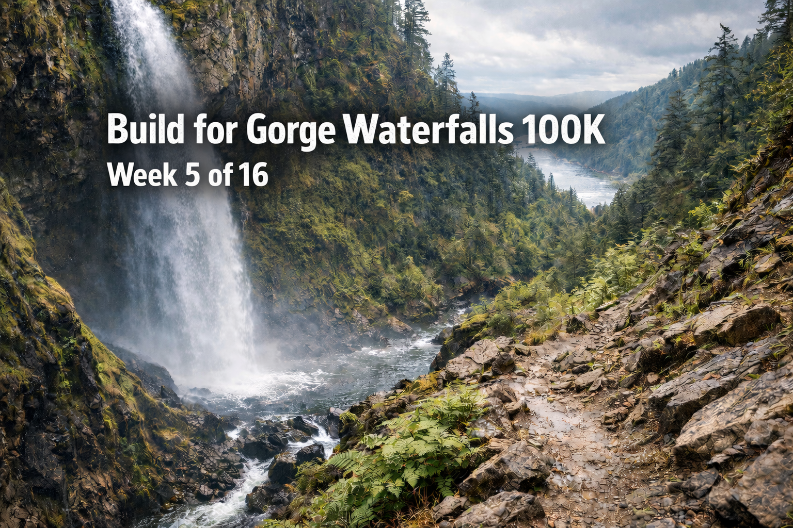

I didn't write much about my training the last year, and I regret it. Now that I'm self coaching, I plan to capture it.

I'm in **week 5 of a 16-week block** toward the **[Gorge Waterfalls 100K](https://www.daybreakracing.com/gorge-waterfalls-100k)**, one of the more iconic ultras in the Pacific Northwest. The course runs through the Columbia River Gorge and does exactly what the name suggests: big scenery, waterfalls everywhere, and long stretches of runnable trail that feel friendly right up until the climbing and descending catch up with you. It's a legit 100K with around **11,000 feet of gain**, and it rewards steady pacing and legs that can take repeated hits.

I ran it last year and had a great time. I finished in **14:25:19**, **166th out of 310**. For my first 100K and the longest run I'd ever done, I was happy with that. The day went about how you'd expect. I messed up hydration and electrolytes, rolled my ankle hard, and spent a lot of time dealing with small problems instead of racing clean. But I kept moving, ran whenever I could, and made it to the finish. It hurt, but it was the good kind of hurt.

This year, I want to do better.

Last year I came to a realization: I'm actually decently fast. Not just "fast for me," but fast enough to be competitive in the right races. I finished top three in two races last year, one at 5K and one around 24 miles, and that changed how I think about training. I'm still an ultra runner, still focused on long efforts and durability, but I'm not showing up just to survive anymore. I want to race.

There are a few races on the calendar between now and Gorge that help anchor the build. First up is **[Fort Ebey Kettles Marathon](https://nwtrailruns.com/events/fort-ebey-kettles-trail-run/) on 2/14**, which is exactly the kind of winter trail marathon I like. Honest running, nothing gimmicky, and a good way to check fitness and pacing without getting precious about the result. After that, I'll probably run **[Badger Mountain](http://www.badgermountainchallenge.com/) again on 3/28**, and I'm still deciding between the 50K and the 50-mile. I loved that race last year, and the course fits well into a 100K build. Long, steady work and enough time on feet to matter.

The rest of the season depends on how the 100-mile lotteries shake out. I already missed Western States, Hard Rock, and The Bear, so now I'm waiting on the one that matters most to me: **[Cascade Crest 100](https://www.cascadecrest100.com/)**, with results coming out **1/21**. I finished it last year and it was an incredible experience. At the same time, the last 20 miles absolutely wrecked me. I finished, but it wasn't pretty. I'd like another shot at that course with better preparation and a chance to clean it up.

The main training goal this year is consistency. I'm aiming for a sustainable **60 miles per week**, which should land me a bit over **3,000 miles for the year**. That feels like the right balance for me. Enough volume to build real strength and durability without turning training into a constant recovery problem. Train hard, recover, repeat.

Here's the plan for this week:

| Day | &nbsp;&nbsp;&nbsp; | Training |
|-----|--|----------|
| Monday | | Rest day, plus sauna and a lot of food |
| Tuesday | | Easy ~10 miles with **5 x 20-second strides** |
| Wednesday | | Main workout: 2–3 mile warm-up, then 3 sets of **3/2/1 minutes fast**, 1 min easy between reps, 3 min easy between sets, plus a few short fast strides at the end |
| Thursday | | Easy 8 miles to keep the volume steady and let the legs settle |
| Friday | | Easy 8 miles to keep the volume steady and let the legs settle |
| Saturday | | **[Snoqualmie River Half Marathon](https://www.sammamishrunning.com/event-details/snoqualmie-river-half-13-1-10k-5k)** through Sammamish Running. I've never done it, and it sounds like a straight road half, which isn't really my thing, but it's a good stimulus in the middle of my build. It also gives me an excuse to wear the **Nike Alphaflys**, which I love. |
| Sunday | | Easy run with a few strides to close the week out |

The work this week is designed to connect speed with durability. The Wednesday interval session keeps turnover and aerobic power in the mix without creating lingering fatigue, while the Saturday half marathon provides a long, uninterrupted effort that forces honest pacing and sustained load. Together, they bridge early-season speed work with the kind of continuous stress that shows up late in long races.

This week is also a checkpoint. Not a test of peak fitness, but a way to confirm that speed can coexist with volume, and that harder efforts don’t derail the rest of the week. If I come out of it feeling tired but stable, that’s a win. It means the foundation is holding and the build can keep pushing toward more specificity.

Overall, I feel good. I love Hans Troyer this week and this week I'm vibing to the "mid and fit" mindset. Time to show up, keep stacking the days and weeks, and build toward something that matters.

I'll post a recap at the end of the week. Let's roll.