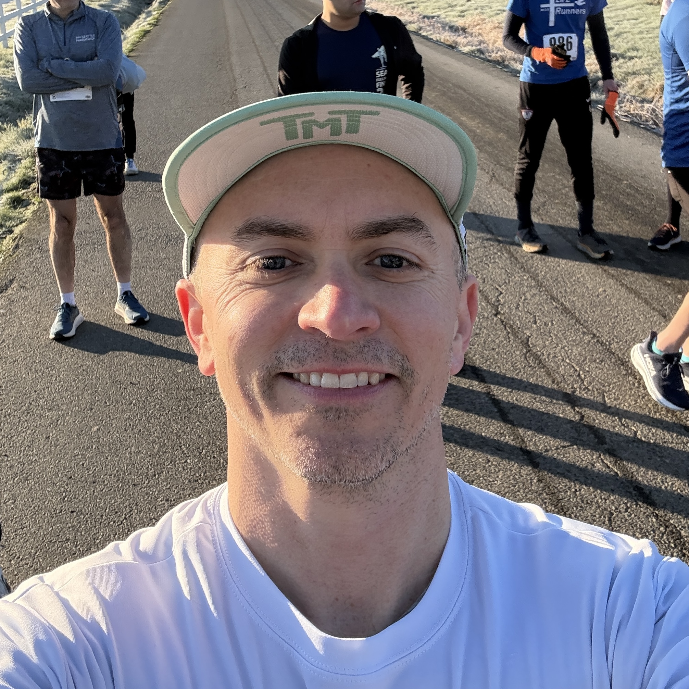
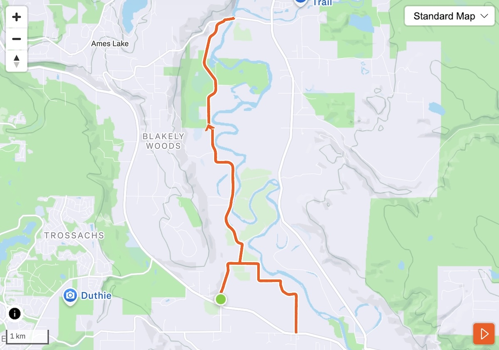
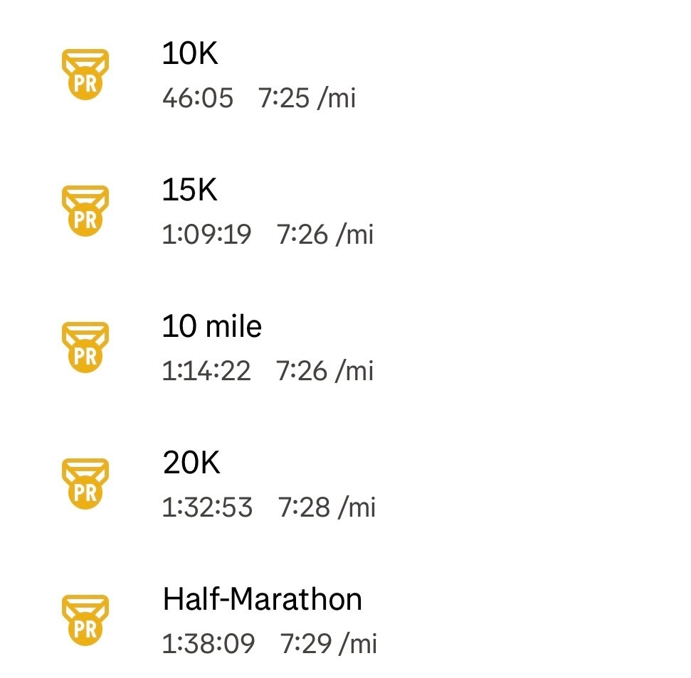

Some races are circled on the calendar months in advance. Others happen because you wake up one morning, feel oddly good, and decide, *yeah, let’s see what happens.*

The [Snoqualmie River Half](https://www.sammamishrunning.com/event-details/snoqualmie-river-half-13-1-10k-5k) was very much the second kind.

The race started at the parking lot of the [Aldarra Ball Fields in Fall City](https://maps.app.goo.gl/nSMy95Bf9wJVUW9j7), a place I've been many times watching my daughter play softball. Fun to visit again but for a very different purpose.

This was unapologetically a small, local race. When I arrived, the race director wasn’t even there yet, and things felt pretty casual. But honestly that was part of the charm. No corporate logos, no massive inflatable arches, just runners hanging out in the cold, chatting, and getting ready to run. The vibes were good.

It was *cold*, around 22 degrees Fahrenheit when I got there.

I don’t run in weather that cold very often, so I spent more mental energy than usual figuring out what to wear. I eventually landed on running tights, a long-sleeve shirt with a short-sleeve tee over it, gloves, and a running hat. It ended up being the right call; I was cold at first, but by the end I was just comfortably warm, which is about as good as it gets in those conditions.

I don’t run roads often, but when I do, I pretty much always run in AlphaFly’s these days. Not because they make me faster (though they don’t hurt), but because the mechanical load is so much easier on my body. The foam, the plate, the whole “super shoe” ecosystem is genuinely fascinating. I have two pairs: one reserved for racing and workouts, the other for treadmill and easy runs.

Going into the race, I genuinely didn’t know if I planned to race or just take it easy.

Part of me thought I might treat it like a David Roche–style “power hour” workout and go hard, but then I also considered just taking it easy, especially because my Thursday and Friday workouts had felt off with low energy, some muscle soreness, and leg aches.

But Saturday morning, I felt pretty good.

During my warm-up, I noticed my heart rate was low and relaxed. My legs also felt good.

I’d taken Morton Bicarb around 7 am (22 mg, cut in half) the same way I’d done for a previous 5K, just to give myself the *option* to push hard if the day allowed it.

But even standing on the start line, I still hadn’t decided.

There weren’t many runners - maybe 25 total across the half, 10K, and 5K. The start itself was casual and a bit late. But overall, everyone was smiling and ready for some fun.

And then, we were off!

The course was mostly flat, with a tiny 15–20 foot hill right at the start, then long, quiet stretches through rural farmland, trees, and open fields. It wasn’t a pure out-and-back, but close enough; and I like the format, as I enjoy seeing other runnings and shouting encouragements.

Early on, I found myself near the front. A really fast woman took the early lead, and I settled in behind a guy running around 7:45 per mile. Historically, that’s been right around threshold pace for me, so I wasn’t sure if it was smart to hang there, but it felt comfortable.

At the first turnaround, about two miles in, the leading woman came by. I congratulated her and asked if she was running the half or the 10K.

“Half,” she said. I laughed and shouted, "damn, I'm going to have to speed up!"

I moved past the guy I’d been following (he was running the 10K) and committed to the race. When I turned around, I realized I already had a decent gap on the rest of the field. From there, the race settled into a rhythm.

For much of the rest of the race, I hovered right around 7:30 per mile, heart rate sitting in mid–zone 3. It felt hard, but not painful; the kind of effort that’s demanding without being desperate. “Comfortably uncomfortable” is the cliché, but it fit.

Aid stations were set up every few miles with water, Gatorade, and snacks, but once I was in race mode, I stuck with what I had. I carried two 500 ml soft flasks with Precision Hydration 1000, started with a 40g caffeinated cola gel, took another mid-race, and sipped about 90g of Precision Flow gel over the course of the run. Basically what I do for all my ultra races.

The scenery was quite lovely: farms, trees, the occasional house, and very little traffic. Around mile 8, after crossing the bridge over the Snoqualmie River, there was another turnaround. Just before it, the lead runner passed me again, flying, strong, and smooth.

After turning around, I started passing by the other half marathoners. Lots of smiles, some looking like they were in dark places. I’ve all been there.

I held the 7:30 pace, and with less than a mile to go, stepped up to a 6:45 pace. More uncomfortable, but also stragenly good.

At the end of the day, I was quite happy with the race. Not only did I get PRs across the board (for the 5K, 10K, 10 mile, 20K, and half-marathon), but also my first win.

At the finish, I was handed a medal, a $15 Starbucks gift card, and a Chipotle burrito.

Does that make me a pro now? 😂

This was a last-minute race with minimal expectations, and it ended up being a lot of fun. I'm glad I was able to go into it with low expectations. And ultimately, I feel like my fitness is in a good place, solidly on track for the Fort Ebey Kettles Marathon Run on Feb 14 and Gorge Waterfalls 100K in April.

Let's roll.