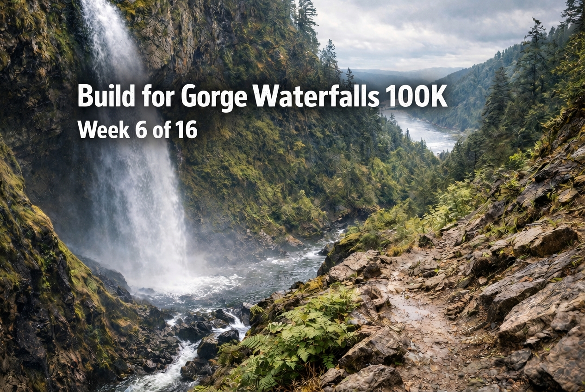

Week 5 went well. Really well, actually.

The big event was the [Snoqualmie River Half Marathon](/2026/01/snoqualmie-river-half-13.1m-race-report/), a small local race I wasn't even sure I'd race hard until I was standing on the start line. But I felt good, the legs showed up, and I ended up running 1:38:22 for PRs across 10K, 10 mile, 20K, and the half marathon. Also walked away with my first overall win, which was a nice surprise.

That kind of effort takes something out of you, though. Not catastrophically, but enough that you need to respect it. Which brings me to week 6: an aerobic down week.

The idea here is simple. After a harder week with a race effort baked in, you dial back the intensity and let the body absorb the work. It's not about being lazy; it's about being smart. The fitness doesn't come from the workouts themselves. It comes from recovering from them. If you keep hammering without rest, you just dig a hole.

So this week is about steady, relaxed running. No hard intervals. No race efforts. Just aerobic work, some easy hills, and a bit of vert to start building specificity for Gorge Waterfalls 100K and its 11,000 feet of climbing.

Here's the plan:

| Day | &nbsp;&nbsp;&nbsp; | Training |
|-----|--|----------|
| Monday | | Rest day. Sauna, good food, full recovery. |
| Tuesday | | 6–12 miles easy with **5 x 20-second hill strides**. Keeping the legs turning over without adding stress. |
| Wednesday | | 10–13 miles easy to moderate, progressing effort as the run goes. 2-mile easy cool-down. |
| Thursday | | 1.5–2.5 hours easy cross-training. Mountain Legs. |
| Friday | | 4–12 miles very easy with **5 x 20 seconds fast / 2 min easy**. Another low-stress day to keep things moving. |
| Saturday | | 10–16 miles easy over hills. Pure aerobic day. Mountain Legs. |
| Sunday | | 8–14 miles easy over hills or easy/moderate cross-training. Pure aerobic day. Mountain Legs. |

The theme is clear: aerobic work, vertical exposure, and letting the body catch up.

One thing I'm trying to keep in mind is I will also travel this week, which brings it's own kind of stress. And I'm a firm believer that stress is stress.

Fort Ebey Kettles Marathon is coming up on February 14, and I want to show up feeling fresh and ready to race. That means being patient now. Stacking easy days, staying consistent, and trusting that the recovery is just as important as the hard stuff.

I'm feeling good about where I'm at. The half marathon confirmed my fitness is tracking in the right direction, and now it's time to let that settle in before pushing again. The build continues.

Let's roll.