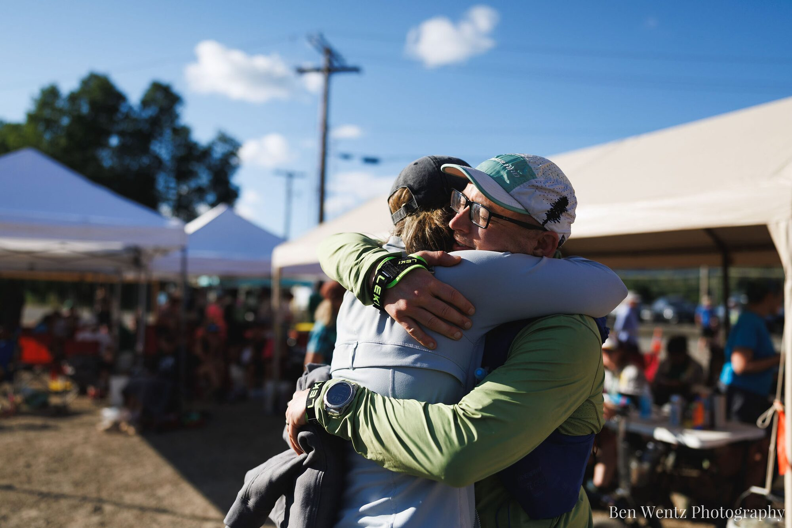

On Friday, July 17, I finished the Cascade Crest 100 in [33:08:47](https://ultrasignup.com/results_participant.aspx?fname=Wade&lname=Wegner). That put me 102nd out of 130 finishers. More importantly, it was my second finish at Cascade Crest and earned me my second buckle.

It has been a couple of weeks, and I still get emotional thinking about the finish. I am incredibly proud of this one.

Why? Well, six weeks before the race I wasn't even sure I'd be able to start. Then, less than a day before the race, the course changed completely.

Let me back up.

# My Training this Year

I had a fantastic start to 2026. In January, I won a road half marathon. I finished [3rd at the Fort Ebey Kettles Marathon](/2026/02/fort-ebey-kettles-trail-marathon-2026/) in February. Badger Mountain 50M in March was a disaster for my stomach, but at [Gorge Waterfalls 100K](/2026/01/gorge-waterfalls-100k-build/) in April I ran almost 51 minutes faster than I had in 2025. Even better, my legs still felt strong at the end.

And then, about a week after Gorge, my right hip began bothering me.

The pain continued to get worse. On May 24, I made it through a 16-mile run and it spread into my right knee. That turned out to be my final long run before Cascade Crest.

For the next six weeks, most of my training happened on the bike trainer or while hiking uphill on the treadmill. I kept the volume between 10 and 12 hours each week and managed a few short runs, but that was about it. Lots of aerobic work. Very little actual running.

Was that enough to finish 100 miles? I had no idea.

I sent a note to David Roche through the SWAP Patreon. I've used his plans for my training and trust his advice. He wrote back, "That 100k is still in your legs and is the best training stimulus!"

That helped. I had been seriously thinking about not starting, but I decided to show up and find out what my hip would let me do. The most important goal was to finish without turning the injury into something worse. If things went well, I thought I could run around 32 hours. Breaking 30 hours would take an amazing day.

At least that was the plan for the normal course.

# Changing the Course

On Thursday afternoon, Teri, the crew, and I were at our Airbnb in Easton reviewing the plan I'd spent the previous six weeks putting together. Race director Jess Mullen sent an email letting us know that a wildfire had closed part of the course. Instead of running the normal loop, we would be running out to Hyak and then coming all the way back.

I said "oh shit" loud enough for everyone to hear and pulled up my pacing spreadsheet.

The Three Queens Fire had been started by a lightning storm on Wednesday night, north of Lake Kachess. It was around 25 acres by Thursday morning. The Forest Service closed the Mineral Creek area before the race crew could mark it, leaving Jess and her team about 20 hours to change the course.

The replacement course had been used twice before when fires affected the race. We would leave Easton, cross Goat Peak, run through the Snoqualmie Tunnel to Hyak, and then turn around and do all of it again in the opposite direction.

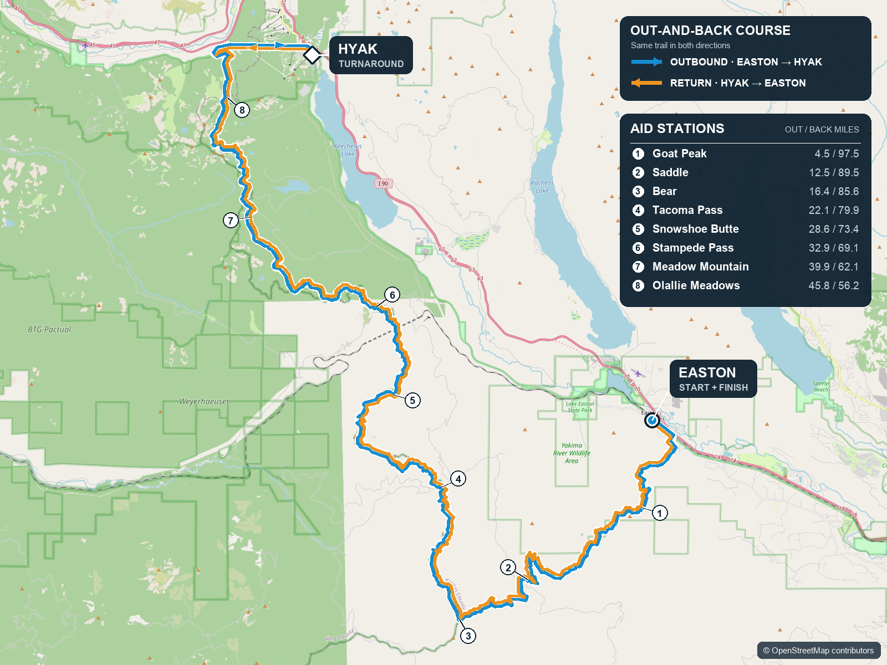

I was definitely disappointed. The final 31 miles had destroyed me in 2025. I lost almost five hours against my plan, and my quads hurt so badly that I had to walk the descents. For the past year, I'd been thinking about the Trail from Hell and the Cardiac Needles and preparing myself to do better.

Now neither one was part of the race.

But what could we do? It was time to build another plan.

We changed the splits and crew locations, moved drop bags and fuel, and worked out a new sleep schedule for the crew. We also had to redo all three pacer sections. Tori would cover more miles than expected, Cam would cover fewer, and Ryan would take the final 22 miles.

Cam was still waiting to fly in. I tried to call him, but the service at the Airbnb kept dropping the call. We eventually figured out his new section over text.

By the time we ate dinner, the spreadsheet predicted a 33:01 finish. That was slower than my goal for the original course, but this version was longer, had more climbing, and required us to cross Goat Peak twice.

Okay, then. 33:01.

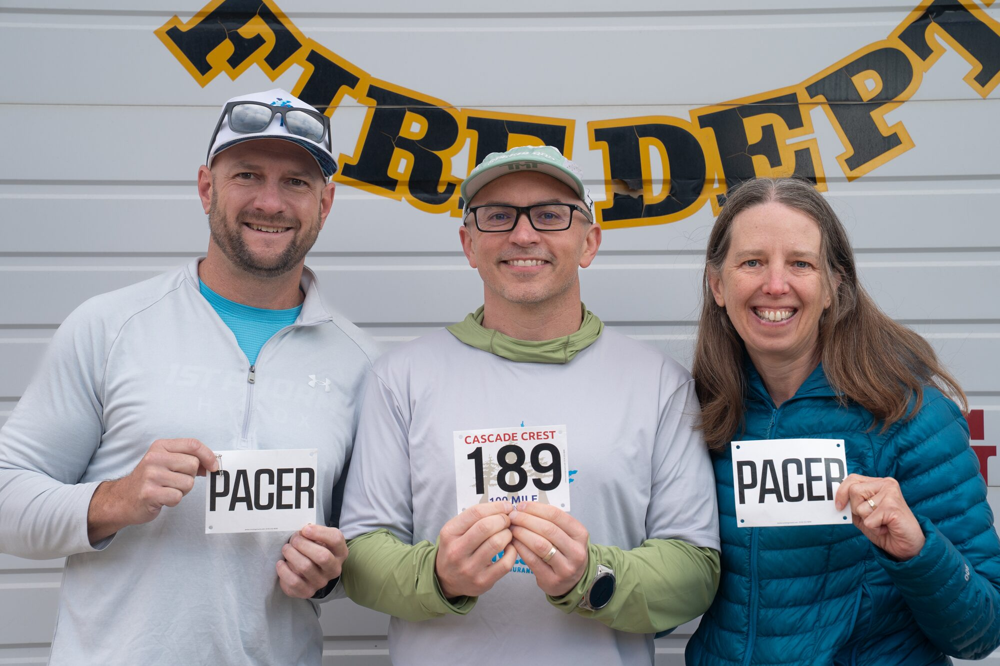

# Easton to Hyak

We left the Easton Fire Station at 9:00 AM on Friday. Oddly enough, I felt pretty calm. I didn't know whether my hip would last five miles or 100, but I was finally going to find out.

First up was Goat Peak.

I hiked the climb without any pain in my hip. Fantastic! Unfortunately, my heart rate was higher than it should have been, and I was moving faster than I thought. When I looked at Strava later, I had set 17 segment PRs during those first climbs.

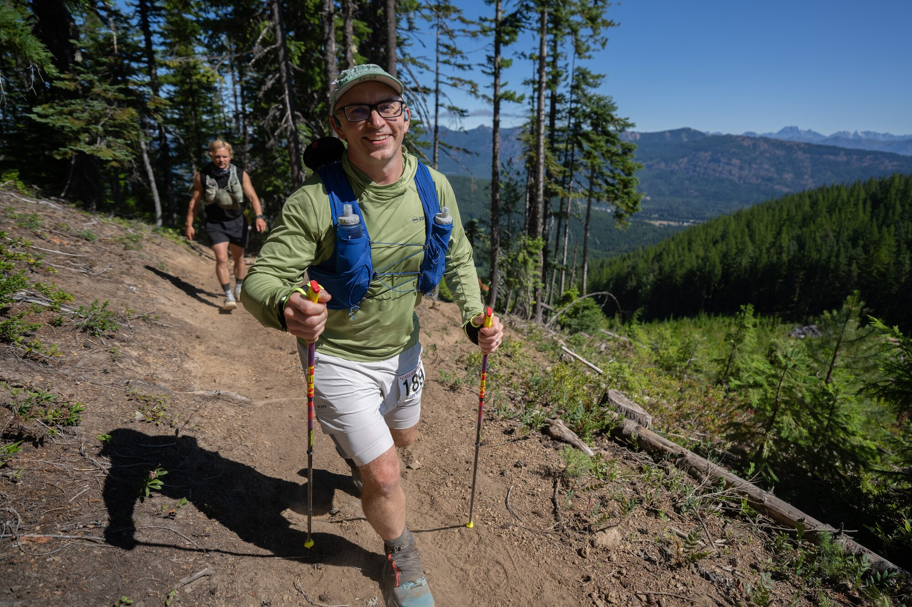

So, yeah, I started too fast.

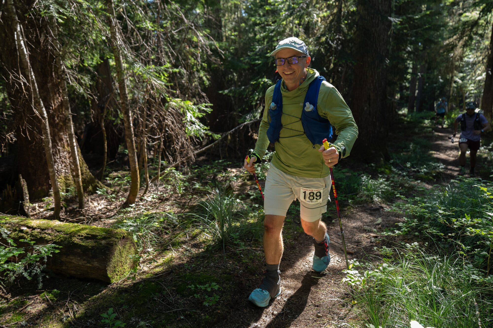

After Tacoma Pass, I backed off and ran the long stretch of the PCT slower than I had in 2025. My hip still wasn't hurting, and I felt pretty good.

Then I made another mistake. During the warmer afternoon miles between Snowshoe Butte and Stampede Pass, I didn't drink enough.

By the time I arrived at Stampede at 5:44 PM, I had a headache. I felt foggy and flat, and I wasn't talking much at the aid station. At Tacoma Pass I'd been 30 minutes ahead of the new plan. Now I was only 18 minutes ahead.

I needed to drink more, but I really didn't like the Gnarly Limeade available at the aid stations. At crew stops I switched to Precision PH 1000 tablets. I also carried a small bag of the tablets so I could use them between crew stops.

Over the next several hours, the headache slowly went away. By Hyak it was gone.

This was familiar. I developed the same headache during Cascade Crest in 2025, also after falling behind on water during the afternoon. Coincidence? I don't think so.

Once it got dark, I went through Meadow Mountain and Olallie, bombed down the ropes (so much fun!), and ran the 2.3 miles through the Snoqualmie Tunnel. I reached Hyak at 11:08 PM, still 17 minutes ahead of the plan, and felt like myself again.

"What you saw at Stampede was dehydrated Wade," I told everyone. "I'm back."

Nineteen minutes later, Tori and I left Hyak and started back through the tunnel.

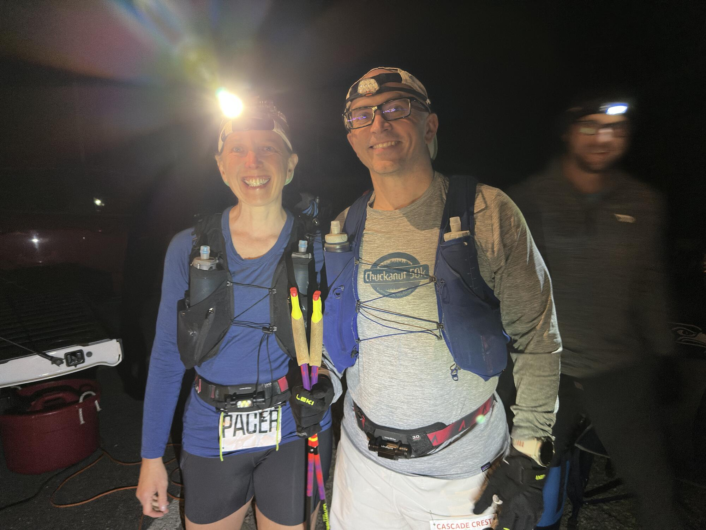

# Hyak to Stampede with Tori

Having Tori with me immediately made the race more fun. As we ran through the tunnel, we passed runners who were still making their way to Hyak. Everyone called out some version of "good job" as we passed each other. This was one part of the out-and-back course I really liked.

The ropes near Olallie were also interesting in the opposite direction. Race organizers use them to help runners get down a very steep slope. On the way back, we had to use the ropes to climb up. Most people seemed to think climbing was easier.

Not me. I'd take bombing down the ropes any day.

At some point during these miles, my right knee began to hurt. We had spent six weeks worrying about the hip, which now felt completely fine, and instead the knee became the problem. Of course.

Fortunately, Tori is a physical therapist. We stopped so she could look at it, and she had me try several stretches. Nothing made a difference. She didn't believe I would cause permanent damage by continuing, though, so I kept moving.

The pain stayed with me all the way to the finish.

My stomach wasn't doing great either. I had terrible gas and needed to make several trips into the woods. It never became another Badger Mountain, thankfully, and I was able to continue eating.

Tori kept me on a 20-minute eating schedule. We hiked uphill and ran the sections where I was still able to run. I also never got sleepy, which was one less problem to deal with.

Our aid-station times were 1:17 AM at Olallie, 3:30 AM at Meadow Mountain, and 5:38 AM at Stampede Pass.

# Stampede to Tacoma with Cam

Seeing the crew at Stampede made me really happy. I was 24 minutes ahead of schedule when I arrived and left with Cam after a 12-minute stop.

Cam did exactly what I needed. He ran in front of me and gave me someone to follow. With the sun coming up and my legs still working, I started to run well again.

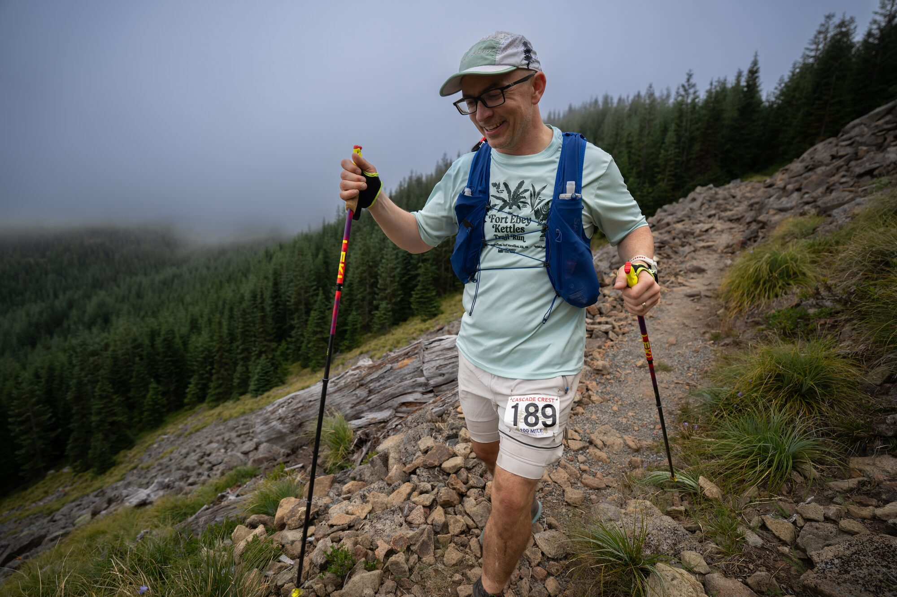

We arrived at Tacoma Pass at 9:01 AM. I was now 51 minutes ahead of plan.

This was around mile 80. I'd been running for a full day and was gaining time. Pretty awesome!

In fact, we got there before the crew was fully set up. They had stopped at the Airbnb, and Teri was still at the car when I came into the aid station. She was very excited to see me.

Ryan was ready to go. We headed out together for the last 22 miles.

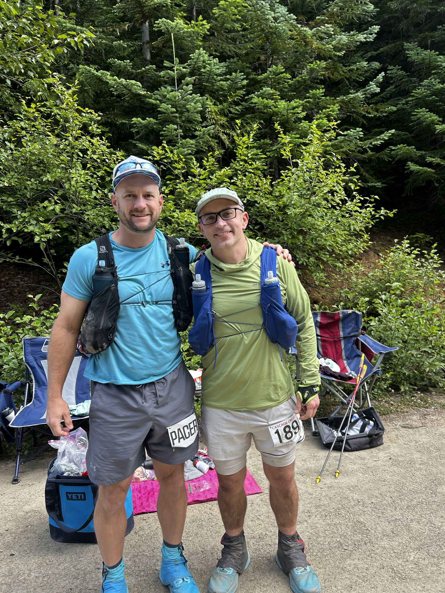

# Tacoma to Easton with Ryan

The trail between Tacoma and the saddle is rocky, and my feet took a beating. My knee also continued to get worse. Whenever I stopped, it stiffened up and required about a quarter mile of movement before it would loosen again.

Still, I reached Saddle 2 at 12:57 PM and remained 44 minutes ahead of plan.

The temperature on my watch reached the low 80s that afternoon. Thanks to the passive heat training I'd done and my sun hoodie, the heat never really bothered me. Volunteers had also carried water into a spot about halfway between Saddle 2 and Goat Peak. Ryan and I both needed that water. Thank you!

Around mile 89, we began the final climb back up Goat Peak. It was eight miles of service road and trail, and I'd been running for roughly 30 hours.

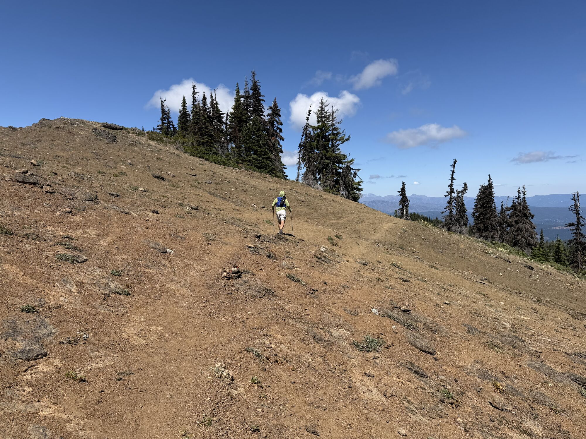

I lost almost all the time I'd gained on this climb.

Before the climb I had been moving around 24 minutes per mile. That fell to 30 minutes per mile, and my heart rate dropped into the 90s. I wasn't sleepy, and I was still able to eat. I just couldn't get my legs, feet, and right knee to move any faster.

Ryan spent nine hours with me and somehow stayed positive the entire time. At one point he was telling me a story, and I interrupted him.

"Ryan, I'm non-verbal right now."

He had also asked me earlier if Eleven was still alive in *Stranger Things*. I didn't answer. Much, much later, I finally said, "No. She died."

Apparently, I needed some time to think about it.

We laughed and continued walking.

# Finishing

From the last curve outside Easton, I could see the finish line about a mile away. That's when I started to get a little emotional. These races always seem so straightforward in the abstract, and so messy in reality. I think that's why I love them.

Before we reached the chute, Ryan moved to the side and let me finish alone. I crossed the line in 33:08:47, and someone handed me my buckle and finisher sweatshirt. Then I looked to my left and saw Teri crying.

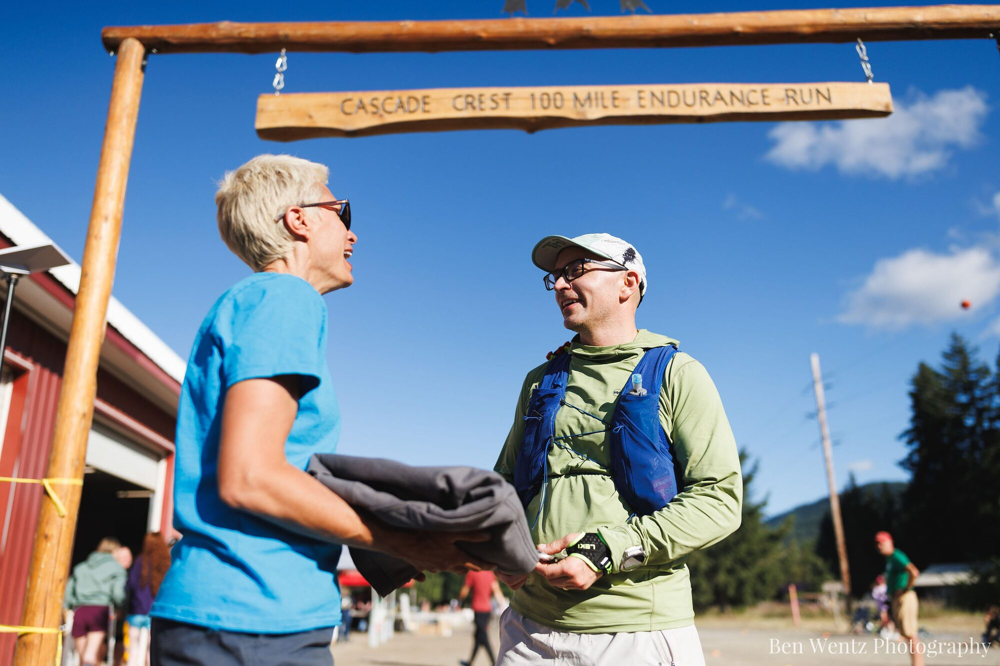

Well, that got me going again.

I was also in much better shape than I had been at the 2025 finish. Last year, I sat under the finish tent shaking and unable to eat. A woman from the fire station kept coming back to check on me.

This year, I drank most of a vanilla milkshake and ate half a hamburger. Later, at the Airbnb, I even ate some of Teri's leftovers while we talked about the race.

Fantastic.

# Looking at the Data

Once I had recovered a bit, I pulled the [race data from my watch](https://www.strava.com/activities/19370394818) and reviewed it with my [TrainUltra](https://trainultra.app) coach. There were a few things I found interesting.

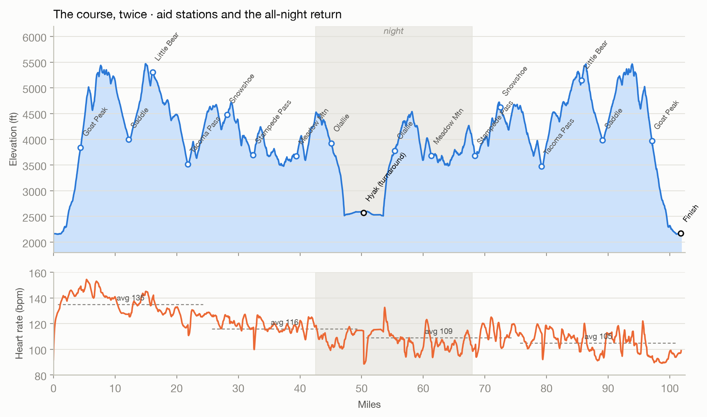

For each quarter of the race, my average heart rate was 135, 116, 109, and 105. As the race continued, I moved slower and my heart rate kept falling. Aerobic fitness wasn't the limiting factor at the end. My legs and feet were exhausted, and my knee hurt.

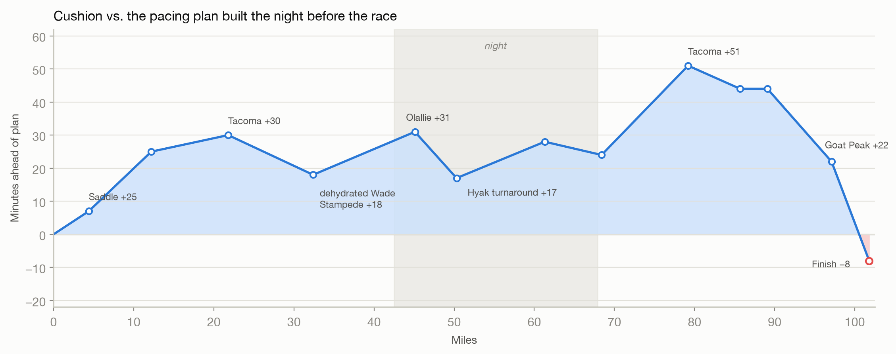

How accurate was the new plan we made on Thursday? Pretty accurate! We predicted 33:01, and I finished eight minutes slower. I fell behind before Stampede, worked my way back to 51 minutes ahead at Tacoma, and lost most of that time during the climb back over Goat Peak.

The other number that jumps out is 109 minutes. That's roughly how much time I spent at aid stations and making bathroom stops. Some of it was unavoidable, but it's still a lot of time.

Here are a few more numbers:

* My watch recorded 101.8 miles and more than 23,000 feet of climbing.
* I averaged around 400 calories, or 100 grams of carbohydrates, each hour. We ran out of Precision Flow gel late in the race, so during the final two hours I ate two 40-gram Enervit gels per hour.
* Strava gave me 49 segment PRs.

# What I Learned

The biggest success was fueling. I ate close to 100 grams of carbohydrates every hour, kept the food down for 33 hours, and was able to eat again at the finish. Compared to 2025, that's an enormous improvement. I'm going to continue testing this in training, although I'll probably target 80 grams per hour for those runs.

Hydration clearly needs more work. Two years in a row, I've fallen behind on drinking during the warm afternoon hours. Two years in a row, I've ended up with a headache. I need a more specific plan for that part of the day.

And what about all the cycling and treadmill hiking? It worked well enough to maintain my aerobic fitness. It did not prepare my legs and feet to run 100 miles. That's hardly surprising since, well, I didn't run very much. I need to figure out how to keep my legs working during the final 20 miles.

# Thank You

Jess Mullen and everyone involved with Cascade Crest somehow changed the course in a single day. Volunteers hiked into remote aid stations, worked all night, carried water onto the course, filled my bottles, and looked after us. This race is special because of them.

My crew was amazing. Teri and Mallory took care of me for more than a day while working from a plan we'd rewritten the night before. Tori ran 18 miles through the night, kept me eating, and helped me understand what was happening with my knee. Cam got me moving again in the morning. Ryan stayed with me for nine hours and 22 miles while I slowly lost the ability to talk.

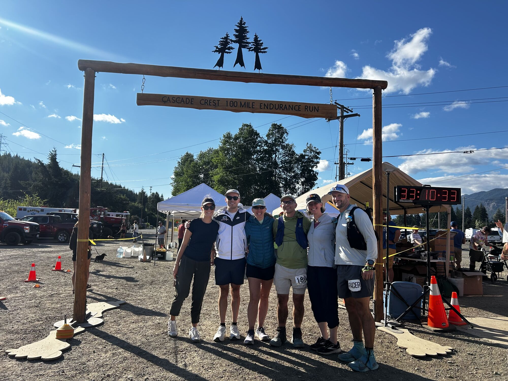

There is no way I finish this race without them. Thank you!

# What's Next

For now, recovery.

After that, I want to spend time improving my uphill power. Beat the Blerch Half is on the calendar for September, and I'd also like to take a shot at a sub-20-minute 5K on Thanksgiving.

Let's roll!
